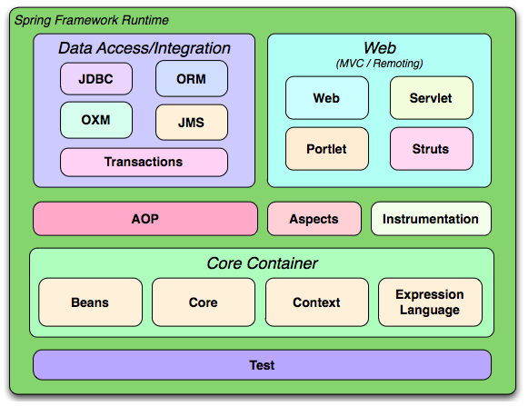
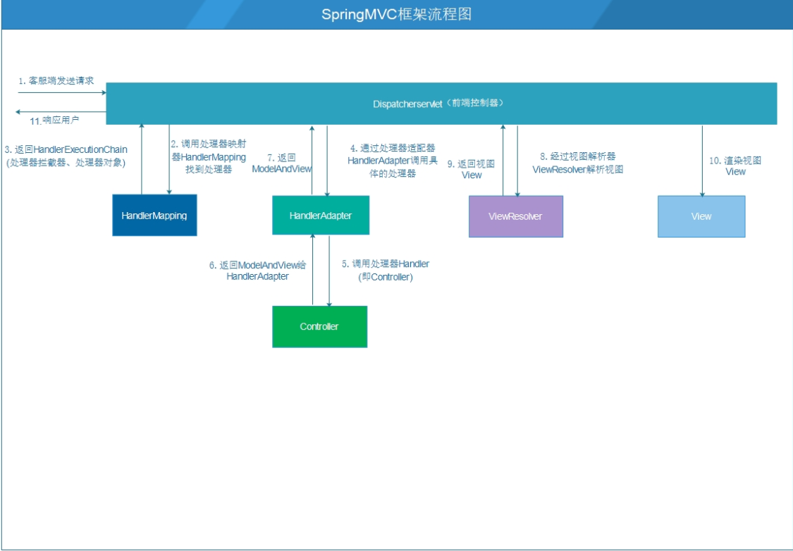
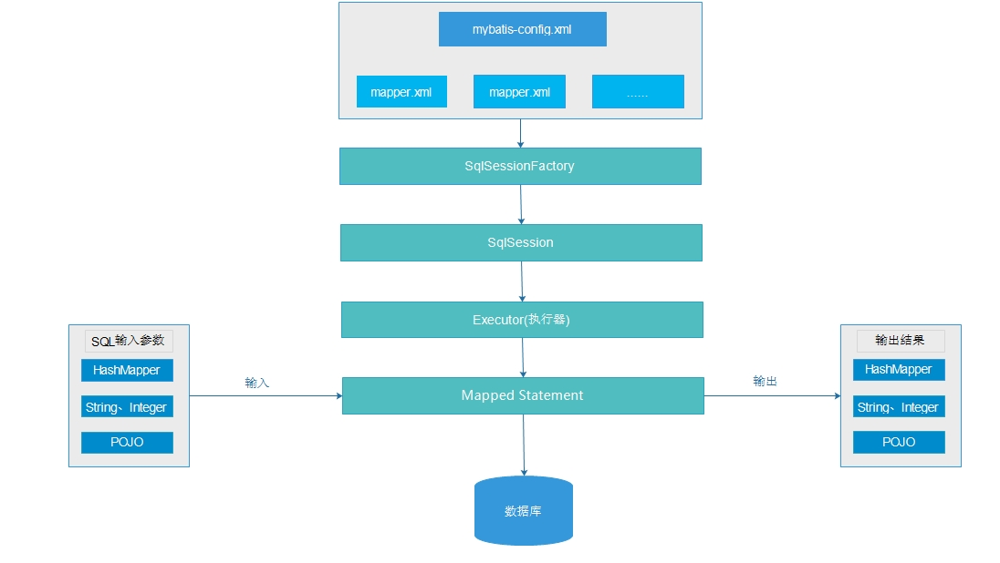

> SSM 框架由 SpringMVC、Spring 和 Mybatis 三大开源框架整合而成，所以了解该框架需先从这三个框架着手。

# Spring

Spring 是整个框架的核心，所以我们先从它开始讲起。

Spring 是 2003 年兴起的一个轻量级的 Java 开发框架，由 Rod Johnson  创建。它解决了业务逻辑层和其他各层的松耦合问题，并将面向接口的编程思想贯穿整个系统应用。简单来说，Spring 是一个分层的 JavaSE/EE Full-Stack（一站式） 轻量级开源框架。为什么说 spring 是分层、一站式、轻量级的框架呢？

首先看分层。JavaEE 经典的 MVC 三层结构为表现层、业务层、持久层，Web 表现层负责页面数据显示、页面跳转调度，例如  JSP/Servlet、SpringMVC；Service 业务层负责业务处理、功能逻辑和事务控制，例如  Service、JavaBean、EJB；而持久层 Dao 则负责数据存取和封装，及与数据库打交道，例如  JDBC、Hibernate、Mybatis。

而一站式，则指 Spring 为 JavaEE 的每一层都提供了解决方案，比如：

- 表现层：Struts1、Struts2、Spring MVC；
- 业务层：IoC 控制反转、AOP 面向切面编程、事务控制；
- 持久层：JdbcTemplate、HibernateTemplate、ORM 框架（对象关系映射）的整合。

至于轻量，则是指从大小与开销两方面而言，Spring 都是轻量的。完整的 Spring 框架可以在一个大小只有 1MB 多的 Jar  文件里发布。并且 Spring 所需的处理开销也是微不足道的。Spring 的出现解决了 EJB 臃肿、低效、繁琐复杂、脱离现实的情况。而且使用 Spring 编程是非侵入式的。Spring 应用中的对象不依赖于 Spring 的特定类。

## Spring 的体系结构

Spring 框架是一个分层架构，它包含一系列的功能要素，被分为大约 20 个模块。这些模块分为 Core Container、Data  Access/Integration、Web、AOP、Aspects、Instrumentation 和 Test，如下图所示：



核心容器（Core Container）包括 Core、Beans、Context、EL 模块。

1. Core 和 Beans 模块提供了 Spring 最基础的功能，Core 模块是核心，为其他模块提供支持，包括  Spring 的核心工具类。Beans 是 Spring 管理实体类 Bean 的主要模块，提供 IoC 控制反转和依赖注入  DI。控制反转即将控制权由原来的程序员自己管理交给 Spring 来管理，依赖注入就是注入对象实例，有四种方式，即接口注入、setter  方法注入、构造器注入和注解注入。
2. Context 上下文模块，主要基于 Core 和 Beans  模块，Context 模块的 Context 包继承了 Beans 包的功能，还增加了国际化（I18N）、事件传播等，Context  上下文模块，还包括企业服务，例如 JNDI、EJB、电子邮件、国际化、校验和调度功能。
3. Expression  Language，表达式语言模块，又称 SpEL，提供了在运行期间查询和操作对象图的强大能力。包含五个主要特性：（1）使用 Bean 的 ID  引用 Bean；（2）调用方法和访问对象的属性；（3）对值进行算术，关系和逻辑运算；（4）正则表达式匹配；（5）集合操作。

## Spring 的三大核心

这三大核心分别为 IOC（Inverse of Control 控制反转）、DI（Dependency Injection，依赖注入）和 AOP（Aspect Oriented Programming 面向切面编程）。

1.IOC（Inverse of Control 控制反转）

IOC，即将对象创建权利交给 Spring 工厂进行管理。比如说

```
Content content = new Content();
```

现在，可以这样写：

```
Content content = ContentFactory.getContent();
```

2.DI（Dependency Injection，依赖注入）

DI 是指在 Spring 框架创建 Bean 对象时，动态地将依赖对象注入到 Bean 组件。简单的说，就是将另外一个 Bean 对象动态地注入到另一个 Bean 中。

DI 的做法是：由 Spring 容器创建 Service、Dao 对象，并且通过注解或配置将 Dao 传入 Servcie，那么 Service 对象就包含了 Dao 对象的引用。比如：

```
    @Service
    public class UserServiceImpl implements UserService {
    @Autowired //通过注解注入UserMapper对象
    private UserMapper userMapper;

    }
```

3.AOP（Aspect Oriented Programming 面向切面编程）

AOP 采取横向抽取机制，取代了传统纵向继承体系重复性代码的编写方式（例如性能监视、事务管理、安全检查、缓存、日志记录等）。

AOP 基于代理思想，对原来目标对象，创建代理对象，在不修改原对象代码情况下，通过代理对象，调用增强功能的代码，从而对原有业务方法进行增强。例如可以在插入 User 对象之前进行打印日志，请看下面的代码示例。

UserService.java:

```
    public interface UserService {

         void add(User user);
    }
```

前置增强类 PrintLogBefore.java：

```
    //前置增强代码
    public class PrintLogBefore implements MethodBeforeAdvice {

    private static final Logger log = Logger.getLogger(PrintLogBefore.class);

    @Override
    public void before(Method method, Object[] arguments, Object target)
            throws Throwable {

        log.info("在插入User之前执行的方法");

      }

    }
```

最后配置切入点：

```
    <bean id="printBefore" class="dreamland.aop.test.PrintLogBefore"></bean>
    <aop:config>
        <aop:pointcut expression="execution(public void save(dreamland.aop.entity.User))" id="pointcut"/>
        <aop:advisor advice-ref="printBefore" pointcut-ref="pointcut"/>
    </aop:config>
```

这样在调用 add(User user) 方法之前就会打印如下内容：

> "在插入 User 之前执行的方法"

# SpringMVC

Spring 为 Web 表现层提供了一个优秀的框架 SpringMVC。和其他 Web 框架一样，也是基于 MVC 的设计理念，此外，它采用了松耦合可插拔组件结构，比其他 MVC 框架更具扩展性和灵活性。

SpringMVC 通过一套 MVC 注解，让 POJO 成为处理请求的控制器，无需任何接口，同时，SpringMVC 还支持 REST  风格的 URL 请求。此外，SpringMVC  在数据绑定、视图解析、本地化处理及静态资源处理上都有许多不俗的表现。它在框架设计、扩展性、灵活性等方面全面超越了 Struts、WebWork 等 MVC 框架，从原来的追赶者一跃成为 MVC 的领跑者。

SpringMVC 框架围绕 DispatcherServlet 这个核心展开，DispatcherServlet  是前端控制器设计模式的实现，提供 Spring Web MVC 的集中访问点，负责职责的分派，而且与 Spring IoC  容器无缝集成，从而可以获得 Spring 的所有好处。

## SpringMVC 框架流程

其框架流程，如下图所示：



接下来，我们对每一个子流程做下说明。

1. 用户发送请求，被 SpringMVC 的前端控制器 DispatcherServlet 拦截。
2. DispatcherServlet 收到请求后调用 HandlerMapping 处理器映射器。
3. 处理器映射器找到具体的处理器，生成处理器对象及处理器拦截器（如果有则生成）一并返回给 DispatcherServlet。
4. DispatcherServlet 调用 HandlerAdapter 处理器适配器。
5. HandlerAdapter 经过适配器调用具体的处理器（Controller，也叫后端控制器）。
6. Controller 将结果封装到 ModelAndView 返回给 HandlerAdapter。
7. HandlerAdapter 将 Controller 执行结果 ModelAndView 返回给 DispatcherServlet。
8. DispatcherServlet 将 ModelAndView 传给 ViewReslover 视图解析器。
9. ViewReslover 解析后返回具体的 View。
10. DispatcherServlet 根据 View 进行渲染视图（即将模型数据填充至视图中）。
11. DispatcherServlet 响应用户。

# Mybatis 介绍

Mybatis 的前身是 iBatis，Apache 的一个开源项目，在 2010 年这个项目从 Apache 迁移到 Google  Code 改名为 Mybatis。Mybatis 是一个类似于 Hibernate 的 ORM 持久化框架，支持普通 SQL  查询、存储过程以及高级映射。Mybatis 通过使用简单的 XML 或注解用于配置和原始映射，将接口和 POJO 对象映射成数据库中的记录。由于 Mybatis 是直接基于 JDBC 做了简单的映射包装，所以从性能角度来看

> JDBC > Mybatis > Hibernate

## Mybatis 特点

主要有以下 5 大特点：

1. 支持自定义 SQL、存储过程、高级映射；
2. 实现自动对 SQL 的参数设置；
3. 实现自动对结果集进行解析和封装；
4. 通过 XML 或者注解进行配置和映射，大大减少代码量；
5. 数据源的连接信息通过配置文件进行配置。

## Mybatis 整体架构

整体架构如下图所示：



接下来，对架构的主要部分做下说明：

1. 配置文件：全局配置文件 mybatis-config.xml，其作用为配置数据源，引入映射文件 Mapper.xml，映射文章的作用是配置 SQL 语句、参数、结果集封装类型等。
2. SqlSessionFactory：相当于 Hibernate 的 SessionFactory，作用为获取 SqlSession，通过  newSqlSessionFactoryBuilder().build(inputStream) 来构建，inputStream  用来读取配置文件的 IO 流。
3. SqlSession：相当于 Hibernate 的 Session，作用为执行 CRUD 操作。
4. Executor：执行器，SqlSession 通过调用它来完成具体的 CRUD，它是一个接口，提供了两种实现，即缓存的实现、数据库的实现。
5. Mapped Statement：在映射文件里面配置，包含 3 部分内容：具体的 SQL，SQL 执行所需的参数类型，SQL 执行结果的封装类型，参数类型和结果集封装类型包括 3 种，即 HashMap，基本数据类型，POJO。

# SSM 框架与 SSH 框架对比

上面我们对 SSM 的各个组成部分做了详细介绍，接下来，我们将通过 SSM 与 SSH 的对比，带大家进一步深入了解 SSM。

其实，SSM 框架与 SSH 框架比较，主要还是 SpringMVC 和 Struts2，Mybatis 和 Hibernate 的对比。

## SpringMVC 和 Struts2 比较

我们从机制、性能、参数传递、设计思想四个方面来看看两者的差异：

1. 机制：SpringMVC 的入口是 Servlet，Struts2 的入口是 Filter， 两者的实现机制不同；
2. 性能：SpringMVC 稍微比 Struts 快些。SpringMVC 是基于方法的设计，而 Struts2 是基于类，每发一次请求都会实例化一个 action，每个 action 都会被注入属性，而 SpringMVC 基于方法，粒度更细。
3. 参数传递：Struts2 在接受参数时，可以用属性来接受参数，这就说明参数可被多个方法共享。SpringMVC 是基于方法的设计，传递参数是通过方法形参。多个方法间不能共享。
4. 设计思想上：Struts2 更加符合 OOP 的编程思想，SpringMVC 就比较谨慎，在 Servlet 上扩展。

## Mybatis 和 Hibernate 比较

我们从难易程度、对象管理、优势对比三个方面来看看两者的差异：

1. 难易程度：Hibernate 的真正掌握要比 Mybatis 难些。Mybatis 框架相对简单容易上手。
2. 对象管理：Hibernate 是完整的对象 / 关系映射解决方案，它提供了对象状态管理的功能，使开发者不需要关心底层数据库系统的细节。而 Mybatis 在这一块没有文档说明，用户需要自己对对象进行详细的管理。
3. 优势对比：Mybatis 可以进行更为细致的 SQL 优化，可以减少查询字段。Hibernate 数据库移植性很好，Mybatis 的数据库移植性不好，不同的数据库需要些不同的 SQL。

综上所述，在性能方面 SSM 框架要优于 SSH 框架，这也是越来越多互联网企业选择 SSM  框架的主要原因。而对于业务逻辑复杂，不太在乎执行效率的传统行业，一般会选择使用 SSH 框架。所以本达人课会选择 SSM  框架来开发，其中应用到的技术将适用于大部分的互联网企业。

下一篇：[第01课：基础环境安装及 Maven 创建父子工程](https://www.kancloud.cn/ryanjiena/dreamland/1124910)